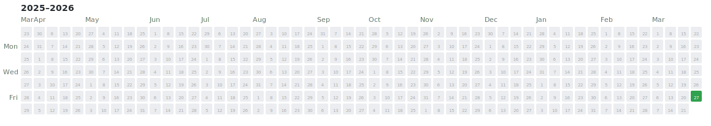

# HackerRank Algorithmic Progress Chronicle

## 📅 Practice Heatmap

## 📝 Activity Log

<!-- BEGIN_LOG -->
## 2026

April 2026

### 01-04-2026

- [print_elements_in_reverse.cpp](https://github.com/himohitj/hackerrank-assessments/blob/main/Linked%20List/print_elements_in_reverse.cpp)

### 02-04-2026

- [grading_students.cpp](https://github.com/himohitj/hackerrank-assessments/blob/main/Arrays/grading_students.cpp)

March 2026

### 27-03-2026

- [mark_and_toys.cpp](https://github.com/himohitj/hackerrank-assessments/blob/main/Greedy%20Algorithm/mark_and_toys.cpp)
- [priyanka_and_toys.cpp](https://github.com/himohitj/hackerrank-assessments/blob/main/Greedy%20Algorithm/priyanka_and_toys.cpp)
- [print_elements.cpp](https://github.com/himohitj/hackerrank-assessments/blob/main/Linked%20List/print_elements.cpp)

<!-- END_LOG -->